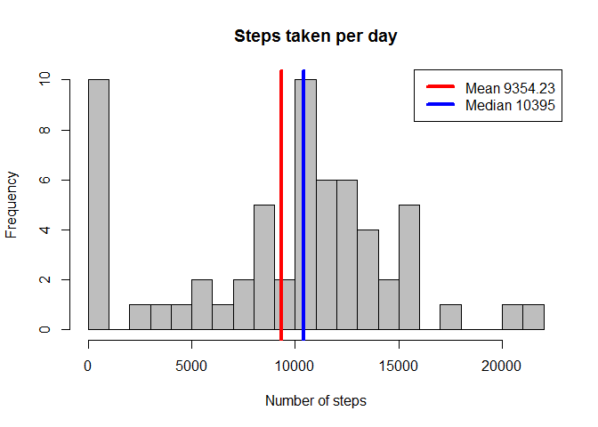
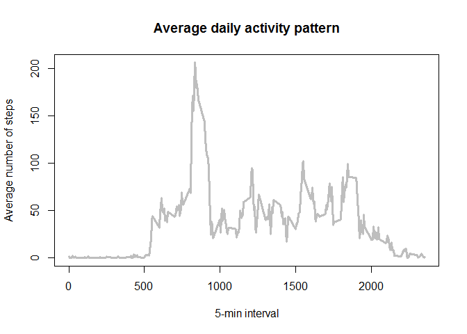
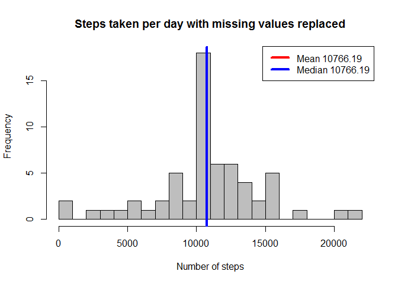
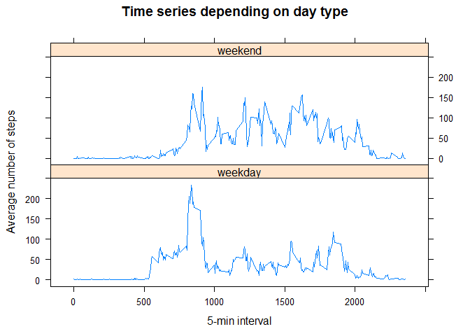

# Reproducible Research: Peer Assessment 1

## Loading and preprocessing the data

**Dataset:** Activity monitoring data [52K]

The variables included in this dataset are:

  **steps:** Number of steps taking in a 5-minute 
  interval (missing values are coded as NA)

  **date:** The date on which the measurement was 
  taken in YYYY-MM-DD format

  **interval:** Identifier for the 5-minute 
  interval in which measurement was taken

The dataset is stored in a comma-separated-value 
(CSV) file and there are a total of 17,568 
observations in this dataset.

**1. Load the data**


```r
filename<-"activity.csv"
data<-read.csv(filename,sep=",",stringsAsFactors=FALSE)
```

**2. Process the data**
Process the data so the date column is in R format:


```r
data$date<-as.Date(data$date, format="%Y-%m-%d")
```

## What is mean total number of steps taken per day?

In this part of the assignment we ignore the missing
values in the dataset.

**1. Total number of steps taken per day**


```r
stepsxday<-summarize(group_by(data,date),
                     stepsday=sum(steps,na.rm=T))
```

**2. Histogram of the total number of steps taken each day**

Function to create the histogram, so it can be called later:


```r
histStepsDay<-function(x,title) {
  # Histogram of the total number of steps taken each day
  hist(x,breaks=25,main=title,xlab="Number of steps",col="grey")
  # Mean and median of the total number of steps
  stepmean<-mean(x)
  stepmedian<-median(x)
  abline(v=stepmean,lwd=4,col="red")
  abline(v=stepmedian,lwd=4,col="blue")
  legend("topright",lty=1,lwd=4,col=c("red","blue"),
         legend=c(paste("Mean",round(stepmean,2)),
                  paste("Median",round(stepmedian,2))))
}
```

**3. Calculate and report the mean and median of the total number of steps**

Create the histogram with computed mean and median:


```r
histStepsDay(stepsxday$stepsday,title="Steps taken per day")
```

\


## What is the average daily activity pattern?

**1. Adjust data to obtain average steps per time interval**

I have created a time series plot of the 5-minute 
interval (x-axis) and the average number of steps
taken, averaged across all days (y-axis).


```r
# Get the required data for the plot
stepsxint<-summarize(group_by(data,interval),
                     stepsint=mean(steps,na.rm=T))
# Create the plot
with(stepsxint,plot(interval,stepsint,type="l",col="grey",lwd=3,
                    xlab="5-min interval",ylab="Average number of steps",
                    main="Average daily activity pattern"))
```

\

**2. Show max step 5-min interval**

I comopute and show the 5-minute interval, on 
average across all the days in the dataset, that
contains the maximum number of steps:


```r
# Compute max step 5-min interval
maxstep<-max(stepsxint$stepsint)
interval<-stepsxint[stepsxint$stepsint==maxstep,1]
# Show on the plot 
with(stepsxint,plot(interval,stepsint,type="l",col="grey",lwd=3,
                    xlab="5-min interval",ylab="Average number of steps",
                    main="Average daily activity pattern"))

points(interval,maxstep,lwd=4,col="blue")
legend("topright",cex=0.8,bty="n",text.col="blue",
       legend=paste("Max average num of steps",
                    round(maxstep,2),"\n at the 5-min interval",interval))
```

\

## Imputing missing values

There are a number of days/intervals where there
are missing values (coded as NA). The presence of
missing days may introduce bias into some
calculations or summaries of the data.

**1. Total number of missing values in the dataset**


```r
sum(!complete.cases(data))
```

```
## [1] 2304
```

The total number of missing values in the dataset
is **2304**.

**2. Strategy to fill in the missing vlaues**

In order to fill in the missing values, I will
use the mean value for the 5-minute interval.

**3. Fill in the missing values with the selected strategy**


```r
# Create a copy of the dataset
data_fill<-data
# Loop: for each interval, copy the average steps.
for (i in 1:nrow(stepsxint)) {
  intval<-stepsxint[i,1]
  stepsavg<-stepsxint[i,2]
  data_fill[is.na(data_fill$steps) & 
              data_fill$interval==intval[[1]],1]<-stepsavg[[1]]
}
```

**4. Show the results in a histogram**


```r
# Number of steps per day considering filled data
stepsxday_fill<-summarize(group_by(data_fill,date),
                          stepsday=sum(steps,na.rm=T))
# Histogram of the total number of steps taken each day
histStepsDay(stepsxday_fill$steps,
             title="Steps taken per day with missing values replaced")
```

\

As shown in the histogram the mean and median 
total number of steps taken per day differ from
the data without filled in values. 

Imputing missing data on the estimates of the total
number of steps has changed the median and mean values,
and now both have the same values.

## Are there differences in activity patterns between weekdays and weekends?

**1. New factor daytype**

I have created a new factor variable "daytype" in the 
dataset with two levels: "weekday" and "weekend" 
indictating whether a given date is a weekday or a weekend day.


```r
# Function that returns the daytype
daytypefun=function(x) {
  dayname<-weekdays(x)
  ind_weekend<-(dayname=="Saturday" | dayname=="Sunday")
  dayname[ind_weekend]<-"weekend"
  dayname[!ind_weekend]<-"weekday"
  dayname
}
# Create the new factor variable daytype
data<-mutate(data,daytype=daytypefun(date))
```

**2. Panel plot with time series**

I have created a panel plot containing a time series
plot of the 5-minute interval (x-axis) and the average
number of steps taken, averaged across all weeday days
or weekend days (y-axis).


```r
# Get the required data
daystepsxint<-summarize(group_by(data,interval,daytype),
                        stepsmean=mean(steps,na.rm=T))

# Create panel plot
library(lattice)
with(daystepsxint,xyplot(stepsmean~interval|daytype,
                         type="l",main="Time series depending on day type",
                         ylab="Average number of steps",
                         xlab="5-min interval",layout=c(1,2)))
```

\
